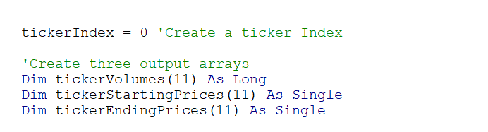

# Stock Analysis

## Overview

Writing and executing code on the first attempt is not always the best way to accomplish a task. A key part of coding is refactoring code. The goal of refactoring code is to make the existing code more efficient by taking fewer steps, using less memory, and/or improving the logic. This process can also be used to make the code easier to read for future users. 

### Purpose

The code developed does its job. However, it might not be efficient or work as well for thousands of stocks. The purpose of this analysis is to refactor the code and determine whether the scrip runs faster.  

## Analysis and Challenges

### Stock Analysis Results

 

Overall, 2017 had a higher return than 2018. Only one stock, TERP, in 2017 had a negative return. At the end of 2017, investing in alternative energy appears to be a smart move. However, the results from 2018 are shocking. All but two stocks have a negative return. Some, including DQ, have a high negative rate. DQ went from having a positive return rate of 199.45% to a negative rate of -62.60% despite having a drastic increase in Total Daily Volume. ENPH and RUN have a return rate of around 82%. Despite their high rates, the market appears to be volatile and would be a risky investment. 

### Challenges

The data ranges significantly between the two years. This indicates there is a strong influence over the market. However, the data set does not have the necessary data for further analysis into why and what the cause could be.

### Refactoring

#### Old Code

#### New Code

