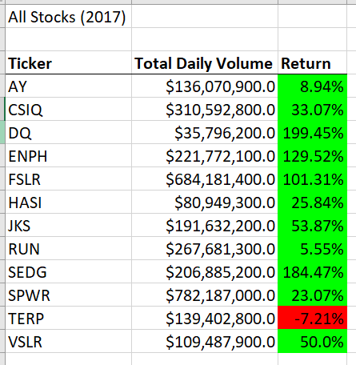
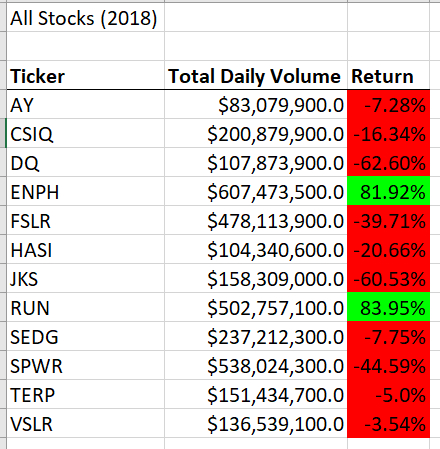
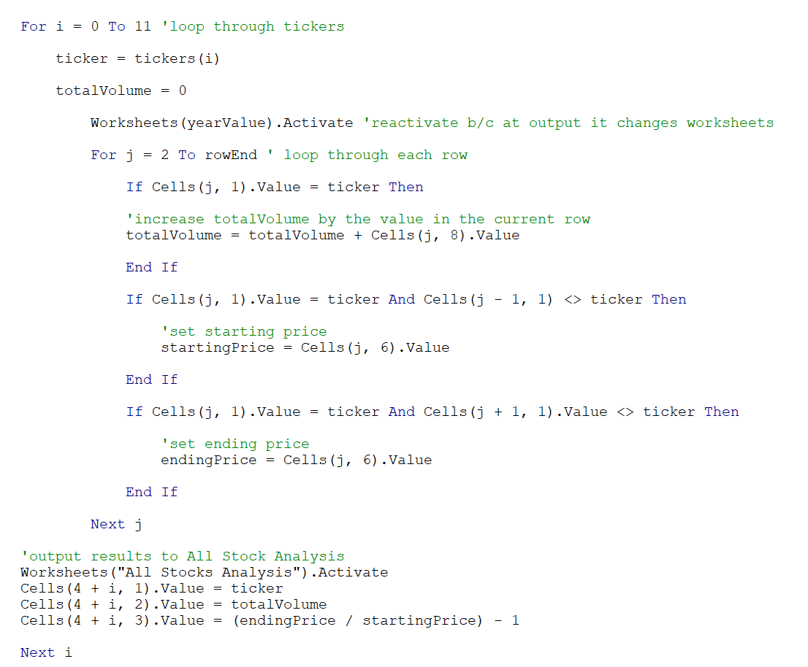
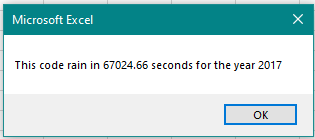
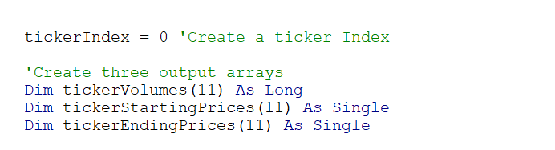
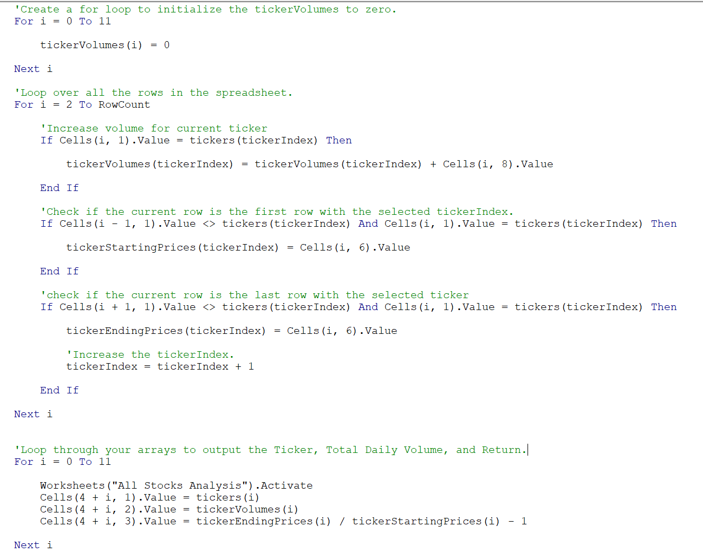
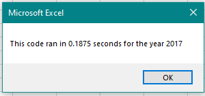
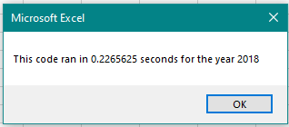

# Stock Analysis

## Overview

Writing and executing code on the first attempt is not always the best way to accomplish a task. A key part of coding is refactoring code. The goal of refactoring code is to make the existing code more efficient by taking fewer steps, using less memory, and/or improving the logic. This process can also be used to make the code easier to read for future users. 

### Purpose

The code developed does its job. However, it might not be efficient or work as well for thousands of stocks. The purpose of this analysis is to refactor the code and determine whether the script runs faster.  

## Analysis and Challenges

### Stock Analysis Results

 

Overall, 2017 had a higher return than 2018. Only one stock, TERP, in 2017 had a negative return. At the end of 2017, investing in alternative energy appears to be a smart move. However, the results from 2018 are shocking. All but two stocks have a negative return. Some, including DQ, have a high negative rate. DQ went from having a positive return rate of 199.45% to a negative rate of -62.60% despite having a drastic increase in Total Daily Volume. ENPH and RUN have a return rate of around 82%. Despite their high rates, the market appears to be volatile and would be a risky investment. 

#### Challenges

The data ranges significantly between the two years. This indicates there is a strong influence over the market. However, the data set does not have the necessary data for further analysis into why and what the cause could be.

### Refactoring

#### Portion of Old Code

 

The initial code written looped over the data set row by row, over and over to display the results. The use of only one array (ticker) presented the need to output the Ticker, Total Volume, and Return before the next iteration. This process lead to a higher execution time of around 67000 seconds

#### Portions of New Code

Instead of one array, when refactoring the code three output arrays were added. This allowed the values for each ticker to be stored based on a the tickerIndex.

The refactored code allows it to loop once through the data and output the Ticker, Total Daily Volume, and Return to the corresponding arrays. After the loop through the data is finished, a loop through the arrays will output the required data by calling on the related tickerIndex for each value. 

This process is not only more efficient, but allows the values to be stored and called upon later. 

 

After refactoring, the execution time decreases dramatically. The average run time for the new code is around .20 seconds. In comparison to the previous running time of 67000, this is significantly more efficient. Where as the previous code worked well with a relatively small dataset, the new code will work better when analyzing a much bigger dataset i.e. the whole stock market.

## Results

Refactoring code is one of the many jobs of coding. In this case, the refactored code runs faster and allows the data to be stored and called upon later. Before, the code had to run through all the data and output the values for each ticker before moving on to the next and rewritting the variables. Now, the code runs through once, adding the values to the existing arrays. Not only is this more efficient but it flattens the code by removing the nested For loops.

There are many advantages in refactoring code including:

* Make the code more efficient: When it comes to run time, working with different sizes of data, refactoring may help to significantly decrease the time it takes to perform tasks. The first time code is written it might not be that efficient and refactoring allows us to go back and improve the code already written. 
* Make the code easier to understand: Restructuring, rewritting, and adding notes can help future coders in understanding what the elements of the code are supposed to do. In the future, this may allow for further refactoring or just a basic understanding of what the code is supposed to accomplish
* Make the code more adaptive: for long-term goals, refactoring code can allow it to be more adaptive. The more efficient and well written the code, the easier it is to edit further for future demands or changes in software

There can also be disadvantages in refactoring code:

* Can be risky if the code is not easy to understand: If the code is not clear (on general purpose or just overall confusing) refactoring can be difficult. 
* Can be risky if the code is big: If there is a lot to comb through, there could be a lot of moving parts. Editing can take a lot of time and making sure everything fits together can be difficult
